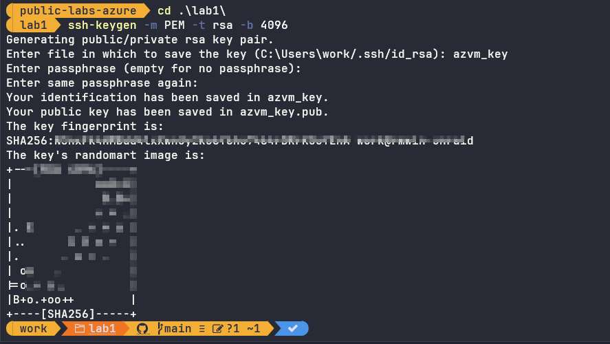
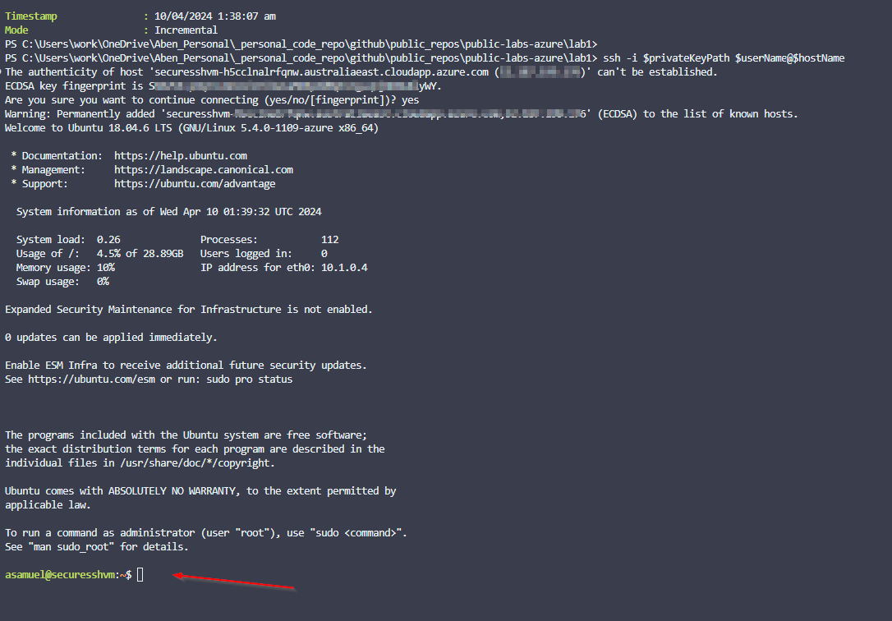

# Steps to recreate this lab

1. Within the lab folder and inside a terminal execute the following to create your Private and Public Key

   ```powershell
   ssh-keygen -m PEM -t rsa -b 4096
   ```

   

2. ***DO NOT SYNC your Private KEY*** to any public repositories. 
3. Run deploy.ps1 post authenticating to your Azure Tenant using ***Connect-AzAccount***
4. Feel free to edit main.bicep to your existing Azure requirements.
   At the end of the Powershell script execution, it should login to your Azure Linux Instance
   

Summary:

- You have successfully build a Linux VM on Azure
- You have then connected to it from your local machine using SSH Pair key instead of password.
- You are on your hourney 